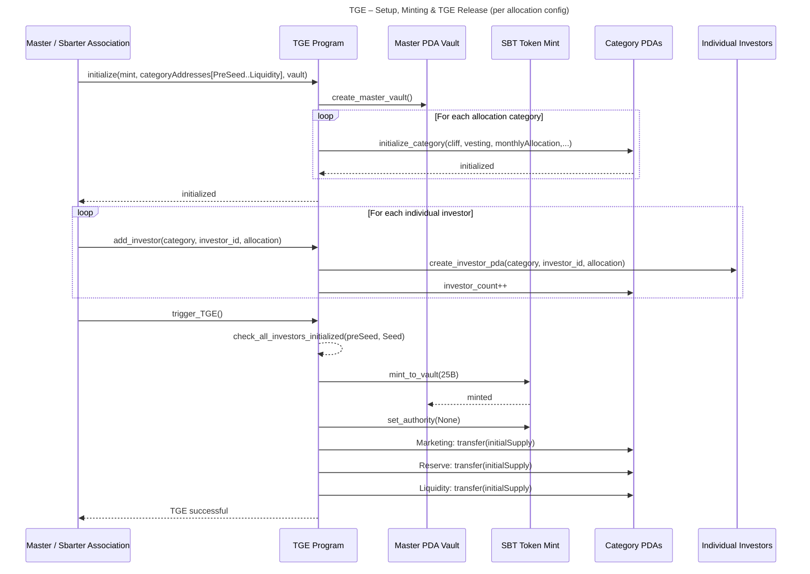
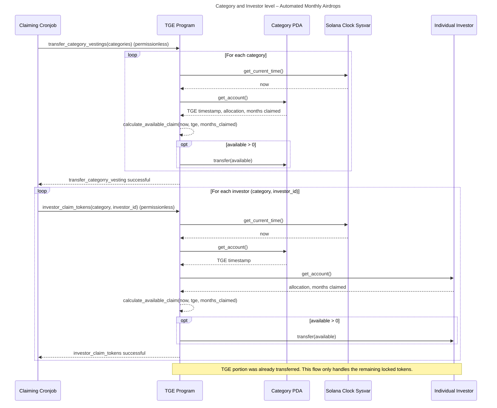
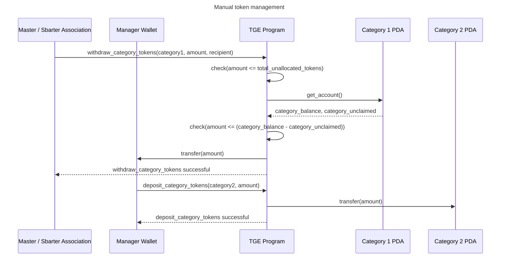

# Sbarter Token Program

The Solana program responsible for TGE and distribution of SBT tokens to categories
and investors according to the cliff & vesting schedule.

## How to test

1. Build the program:

```bash
anchor build
```

2. Run solana-test-validator:

```bash
solana-test-validator -r \
    --bpf-program 47D4TsSiMjG4s2ohbuvQXZEtwYeJ5VPDJaDiBUNxpm8y target/sbpf-solana-solana/release/master_token_program.so \
    --clone TokenzQdBNbLqP5VEhdkAS6EPFLC1PHnBqCXEpPxuEb \
    --clone ATokenGPvbdGVxr1b2hvZbsiqW5xWH25efTNsLJA8knL \
    --url devnet
```

3. Run tests:

```bash
anchor test --skip-local-validator --skip-deploy
```

(`anchor test` normally loads programs automagically, but it never ever works
for me.)

## Key flow sequences

1. Initial setup and TGE



2. Token claims



3. Manual token management


